# 📊 Diagramas del Sistema de Gestión de Biblioteca

Este documento contiene todos los diagramas técnicos del sistema, incluyendo diagramas UML, de arquitectura, flujos de datos y más.

## 🏗️ Diagrama de Arquitectura General

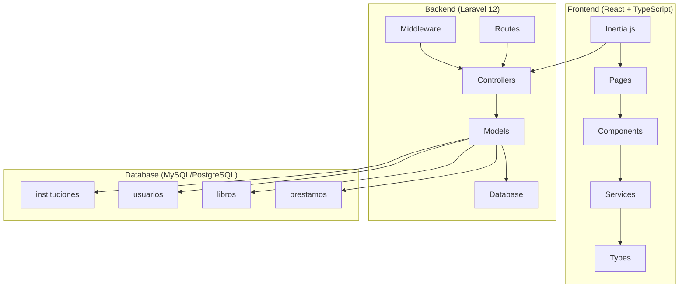

## 📋 Diagrama de Clases UML

```mermaid
classDiagram
    class User {
        +int id
        +string name
        +string email
        +string password
        +timestamp email_verified_at
        +timestamp created_at
        +timestamp updated_at
        +rememberToken()
        +hasVerifiedEmail()
        +markEmailAsVerified()
    }
    
    class Institucion {
        +int id
        +string nombre
        +enum tipo
        +timestamp created_at
        +timestamp updated_at
        +timestamp deleted_at
        +usuarios() HasMany
        +scopePorTipo()
        +getNombreFormateadoAttribute()
    }
    
    class Usuario {
        +int id
        +string nombre
        +string documento
        +enum tipo
        +int institucion_id
        +timestamp created_at
        +timestamp updated_at
        +timestamp deleted_at
        +institucion() BelongsTo
        +prestamos() HasMany
        +scopePorTipo()
        +getNombreMayusculasAttribute()
    }
    
    class Libro {
        +int id
        +string titulo
        +string autor
        +string isbn
        +boolean disponible
        +timestamp created_at
        +timestamp updated_at
        +timestamp deleted_at
        +prestamos() HasMany
    }
    
    class Prestamo {
        +int id
        +int libro_id
        +int usuario_id
        +date fecha_prestamo
        +date fecha_devolucion
        +float costo
        +boolean devuelto
        +timestamp created_at
        +timestamp updated_at
        +timestamp deleted_at
        +libro() BelongsTo
        +usuario() BelongsTo
    }
    
    Institucion ||--o{ Usuario : "tiene"
    Usuario ||--o{ Prestamo : "realiza"
    Libro ||--o{ Prestamo : "es prestado en"
```

## 🔄 Diagrama de Secuencia - Autenticación

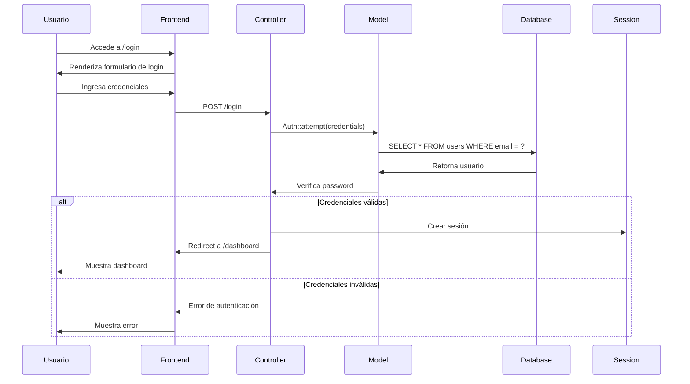

## 🔄 Diagrama de Secuencia - Crear Préstamo

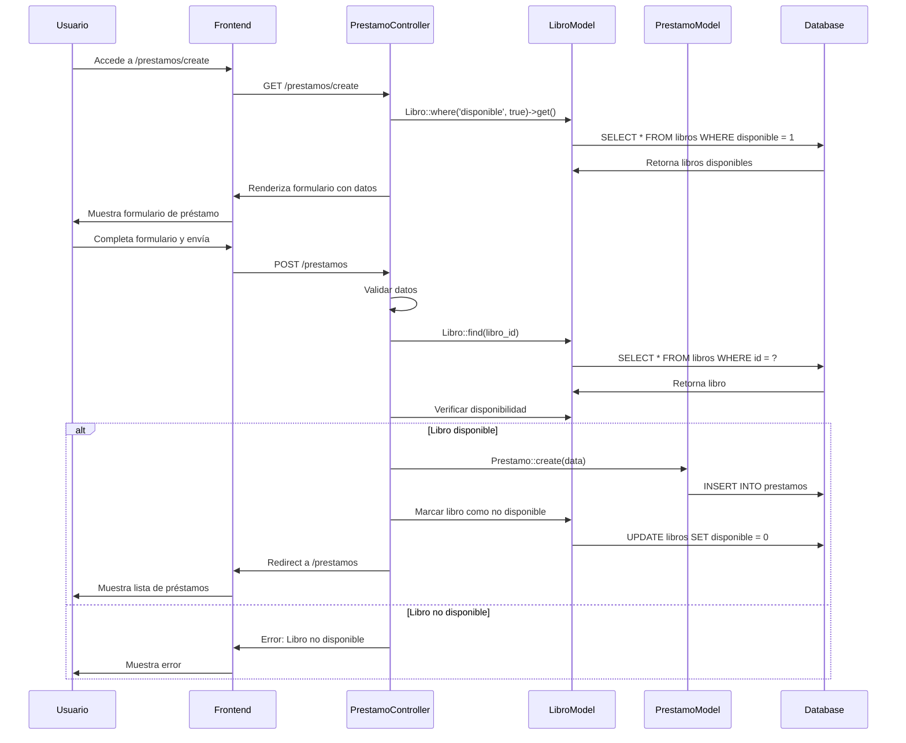

## 🗄️ Diagrama Entidad-Relación (ERD)

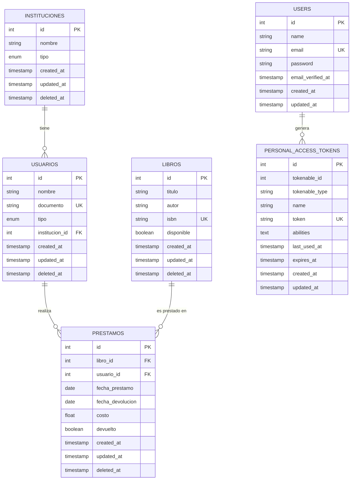

## 🎯 Diagrama de Componentes React

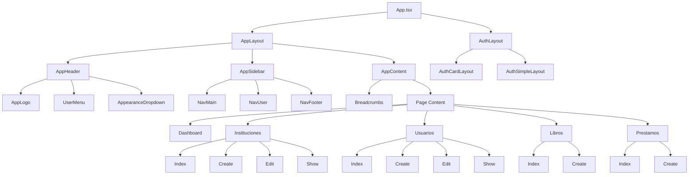

## 🔧 Diagrama de Servicios y API

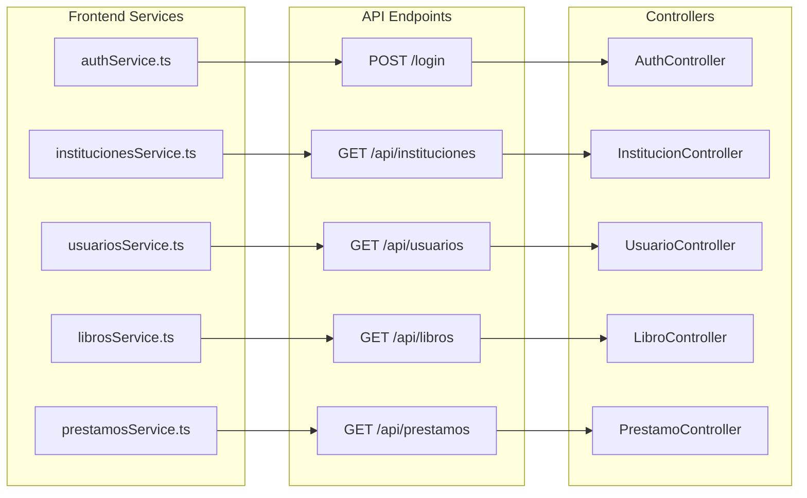

## 🔄 Diagrama de Flujo - Proceso de Préstamo

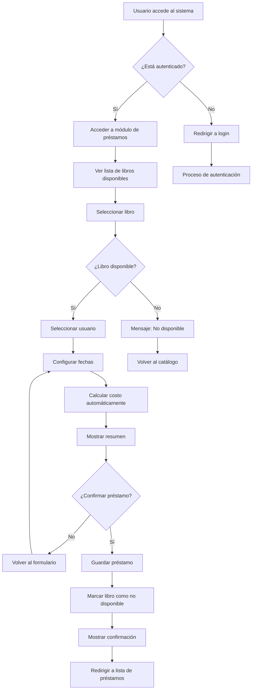

## 🔄 Diagrama de Flujo - Proceso de Devolución

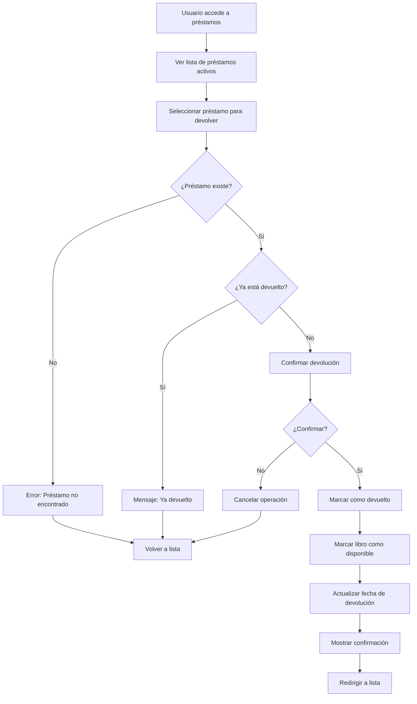

## 🏗️ Diagrama de Arquitectura de Capas

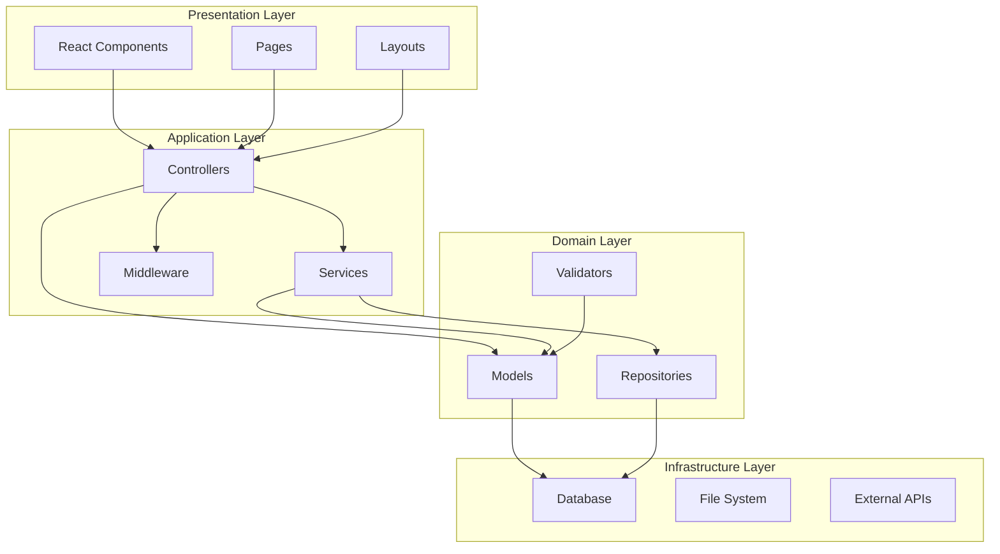

## 🔐 Diagrama de Seguridad y Autenticación

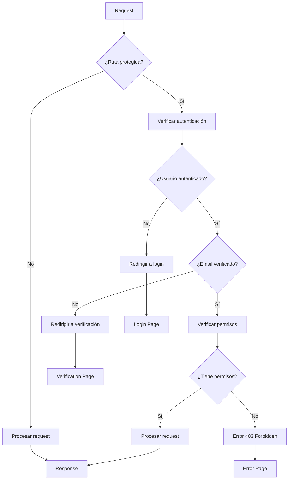

## 📊 Diagrama de Estados - Libro

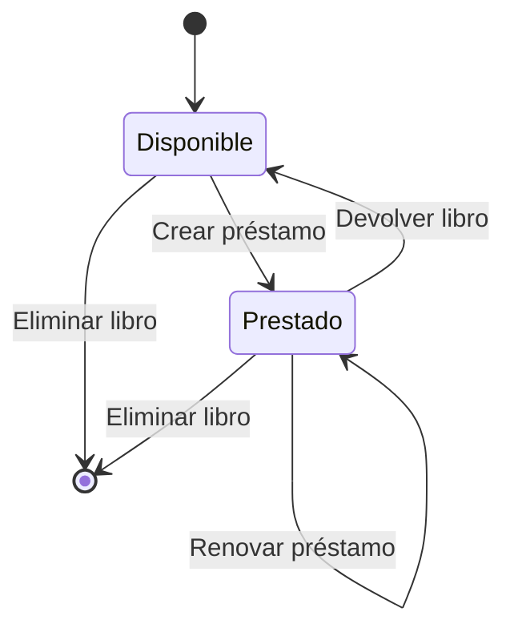

## 📊 Diagrama de Estados - Préstamo

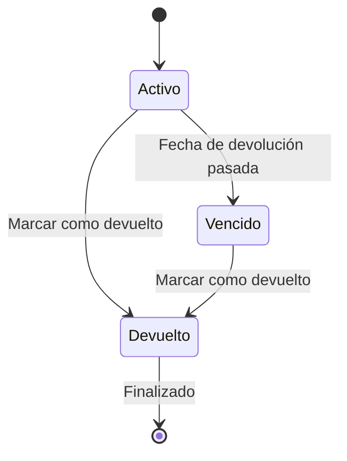

## 🔄 Diagrama de Flujo de Datos

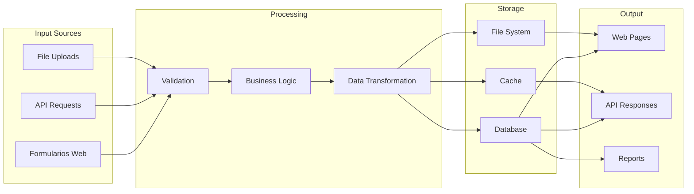

## 🎨 Diagrama de Componentes UI

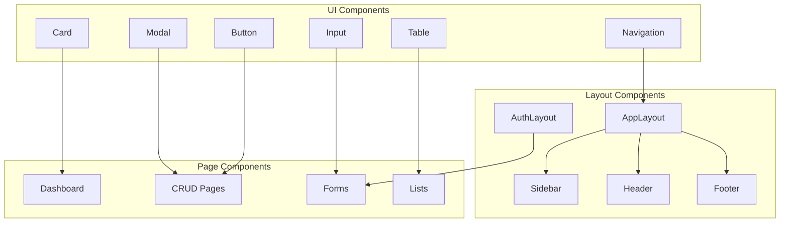

## 🔄 Diagrama de Ciclo de Vida de Desarrollo

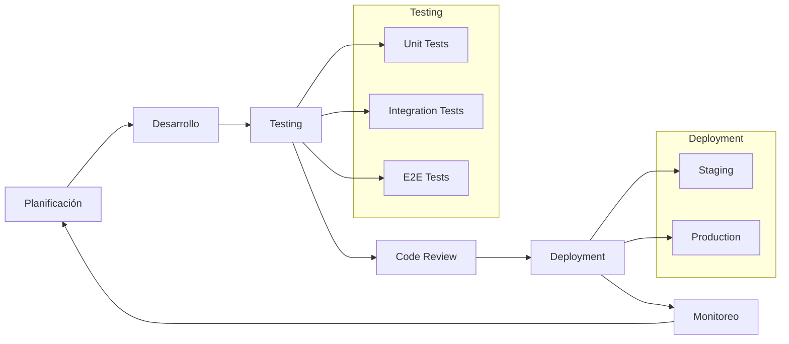

## 📈 Diagrama de Métricas y Monitoreo

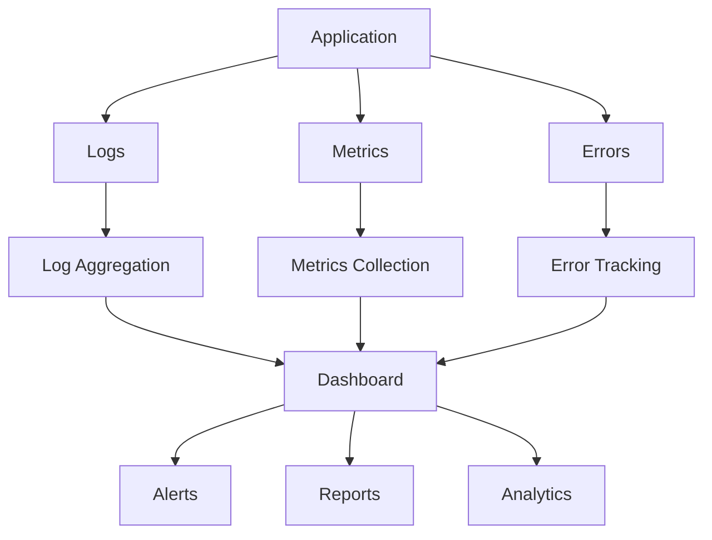

---

Estos diagramas proporcionan una visión completa y detallada de la arquitectura, flujos de datos, relaciones y componentes del Sistema de Gestión de Biblioteca. Cada diagrama está diseñado para mostrar diferentes aspectos del sistema desde diferentes perspectivas técnicas. 