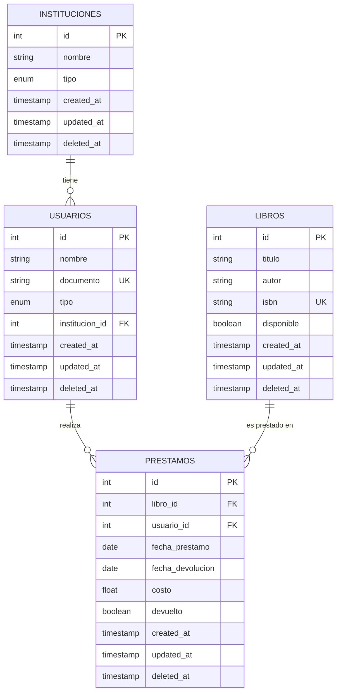
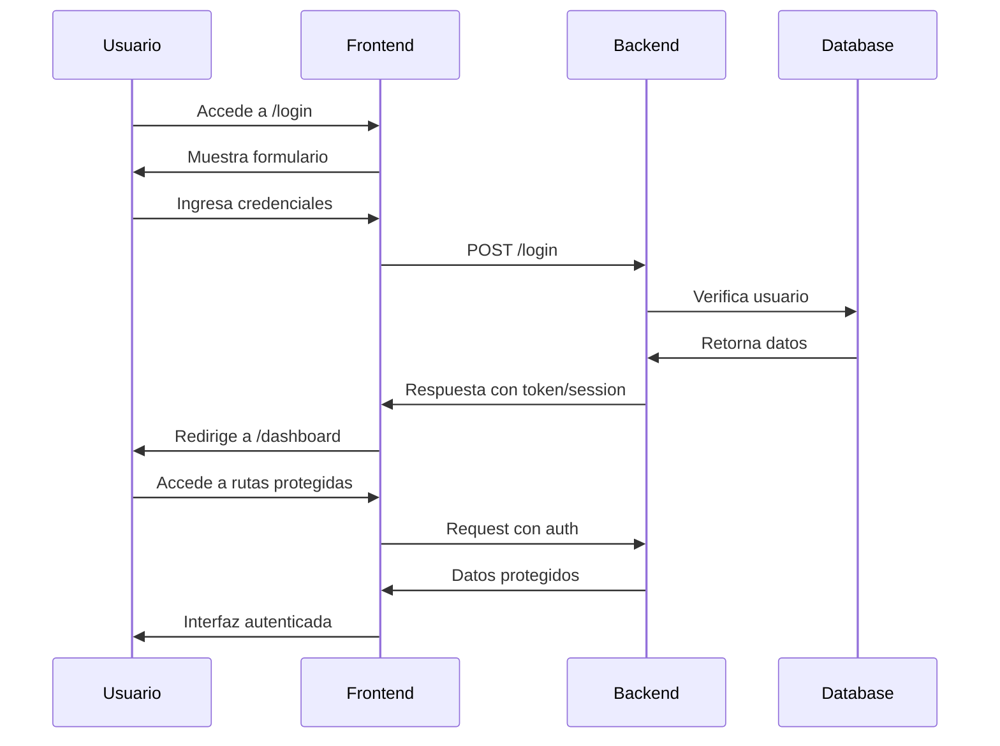
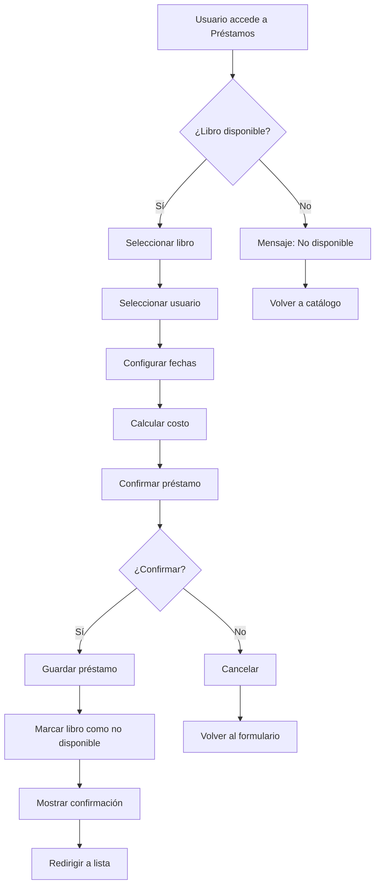

# 📋 Documentación Técnica - Sistema de Gestión de Biblioteca

## 📊 Diagrama de Arquitectura del Sistema

```
┌─────────────────────────────────────────────────────────────────┐
│                        FRONTEND (React + TypeScript)           │
├─────────────────────────────────────────────────────────────────┤
│  ┌─────────────┐  ┌─────────────┐  ┌─────────────┐  ┌─────────┐ │
│  │   Pages     │  │ Components  │  │  Services   │  │  Types  │ │
│  │             │  │             │  │             │  │         │ │
│  │ • Dashboard │  │ • UI        │  │ • API Calls │  │ • TS    │ │
│  │ • Auth      │  │ • Forms     │  │ • State     │  │ • Intf  │ │
│  │ • CRUD      │  │ • Layout    │  │ • Utils     │  │ • Enums │ │
│  └─────────────┘  └─────────────┘  └─────────────┘  └─────────┘ │
└─────────────────────────────────────────────────────────────────┘
                                │
                                │ Inertia.js
                                ▼
┌─────────────────────────────────────────────────────────────────┐
│                      BACKEND (Laravel 12)                      │
├─────────────────────────────────────────────────────────────────┤
│  ┌─────────────┐  ┌─────────────┐  ┌─────────────┐  ┌─────────┐ │
│  │ Controllers │  │   Models    │  │ Middleware  │  │ Routes  │ │
│  │             │  │             │  │             │  │         │ │
│  │ • Resource  │  │ • Eloquent  │  │ • Auth      │  │ • Web   │ │
│  │ • API       │  │ • Relations │  │ • CSRF      │  │ • API   │ │
│  │ • Auth      │  │ • Scopes    │  │ • Validation│  │ • Auth  │ │
│  └─────────────┘  └─────────────┘  └─────────────┘  └─────────┘ │
└─────────────────────────────────────────────────────────────────┘
                                │
                                │ Eloquent ORM
                                ▼
┌─────────────────────────────────────────────────────────────────┐
│                    DATABASE (MySQL/PostgreSQL)                  │
├─────────────────────────────────────────────────────────────────┤
│  ┌─────────────┐  ┌─────────────┐  ┌─────────────┐  ┌─────────┐ │
│  │instituciones│  │  usuarios   │  │   libros    │  │prestamos│ │
│  │             │  │             │  │             │  │         │ │
│  │ • id        │  │ • id        │  │ • id        │  │ • id    │ │
│  │ • nombre    │  │ • nombre    │  │ • titulo    │  │ • libro │ │
│  │ • tipo      │  │ • documento │  │ • autor     │  │ • user  │ │
│  │ • timestamps│  │ • tipo      │  │ • isbn      │  │ • dates │ │
│  └─────────────┘  │ • instit    │  │ • disponible│  │ • costo │ │
│                   └─────────────┘  └─────────────┘  └─────────┘ │
└─────────────────────────────────────────────────────────────────┘
```

## 🔄 Diagrama de Relaciones de Base de Datos



##  Diagrama de Flujo de Autenticación



## 📱 Diagrama de Flujo de Préstamo de Libro



## 🎯 Diagrama de Componentes React

```
App (Root)
├── AppLayout
│   ├── AppHeader
│   │   ├── AppLogo
│   │   ├── UserMenu
│   │   └── AppearanceDropdown
│   ├── AppSidebar
│   │   ├── NavMain
│   │   ├── NavUser
│   │   └── NavFooter
│   └── AppContent
│       ├── Breadcrumbs
│       └── Page Content
├── AuthLayout
│   ├── AuthCardLayout
│   └── AuthSimpleLayout
└── Pages
    ├── Dashboard
    ├── Instituciones
    │   ├── Index
    │   ├── Create
    │   ├── Edit
    │   └── Show
    ├── Usuarios
    │   ├── Index
    │   ├── Create
    │   ├── Edit
    │   └── Show
    ├── Libros
    │   ├── Index
    │   └── Create
    └── Prestamos
        ├── Index
        └── Create
```

## 🔧 Diagrama de Servicios y API

```
Frontend Services
├── authService.ts
│   ├── login()
│   ├── logout()
│   ├── register()
│   └── verifyEmail()
├── institucionesService.ts
│   ├── getAll()
│   ├── getById()
│   ├── create()
│   ├── update()
│   └── delete()
├── usuariosService.ts
│   ├── getAll()
│   ├── getById()
│   ├── create()
│   ├── update()
│   └── delete()
├── librosService.ts
│   ├── getAll()
│   ├── getById()
│   ├── create()
│   ├── update()
│   └── delete()
└── prestamosService.ts
    ├── getAll()
    ├── getById()
    ├── create()
    ├── update()
    ├── delete()
    └── devolver()
```

## 📊 Estructura de Datos Detallada

### Modelo Institucion
```php
class Institucion extends Model
{
    protected $fillable = [
        'nombre',
        'tipo' // enum: escuela, universidad, empresa, colegio
    ];
    
    // Relaciones
    public function usuarios(): HasMany
    {
        return $this->hasMany(Usuario::class);
    }
    
    // Scopes
    public function scopePorTipo($query, string $tipo)
    {
        return $query->where('tipo', $tipo);
    }
    
    // Accessors
    public function getNombreFormateadoAttribute()
    {
        return ucwords(strtolower($this->nombre));
    }
}
```

### Modelo Usuario
```php
class Usuario extends Model
{
    protected $fillable = [
        'nombre',
        'documento', // unique
        'tipo', // enum: natural, estudiante, empresa
        'institucion_id'
    ];
    
    // Relaciones
    public function institucion(): BelongsTo
    {
        return $this->belongsTo(Institucion::class);
    }
    
    public function prestamos(): HasMany
    {
        return $this->hasMany(Prestamo::class);
    }
    
    // Scopes
    public function scopePorTipo($query, $tipo)
    {
        return $query->where('tipo', $tipo);
    }
    
    // Accessors
    public function getNombreMayusculasAttribute()
    {
        return strtoupper($this->nombre);
    }
}
```

### Modelo Libro
```php
class Libro extends Model
{
    protected $fillable = [
        'titulo',
        'autor',
        'isbn', // unique
        'disponible' // boolean
    ];
    
    protected $casts = [
        'disponible' => 'boolean',
    ];
    
    // Relaciones
    public function prestamos(): HasMany
    {
        return $this->hasMany(Prestamo::class);
    }
}
```

### Modelo Prestamo
```php
class Prestamo extends Model
{
    protected $fillable = [
        'libro_id',
        'usuario_id',
        'fecha_prestamo',
        'fecha_devolucion',
        'costo',
        'devuelto' // boolean
    ];
    
    protected $casts = [
        'fecha_prestamo' => 'date',
        'fecha_devolucion' => 'date',
        'devuelto' => 'boolean',
        'costo' => 'float'
    ];
    
    // Relaciones
    public function libro(): BelongsTo
    {
        return $this->belongsTo(Libro::class);
    }
    
    public function usuario(): BelongsTo
    {
        return $this->belongsTo(Usuario::class);
    }
}
```

## 🛣️ Estructura de Rutas Detallada

### Rutas Web (Protegidas)
```php
Route::middleware(['auth', 'verified'])->group(function () {
    // Dashboard
    Route::get('dashboard', [DashboardController::class, 'index'])->name('dashboard');
    
    // Instituciones (CRUD completo)
    Route::resource('instituciones', InstitucionController::class);
    Route::post('instituciones/{institucion}/eliminar', [InstitucionController::class, 'eliminar']);
    Route::post('instituciones/{institucion}/actualizar', [InstitucionController::class, 'actualizar']);
    
    // Usuarios (CRUD completo)
    Route::resource('usuarios', UsuarioController::class);
    
    // Libros (CRUD completo)
    Route::resource('libros', LibroController::class);
    
    // Préstamos (CRUD completo + acciones especiales)
    Route::resource('prestamos', PrestamoController::class);
    Route::post('prestamos/{prestamo}/devolver', [PrestamoController::class, 'devolver']);
});
```

### Rutas API
```php
// Endpoints para integración externa
Route::get('api/instituciones', [InstitucionController::class, 'apiIndex']);
Route::get('api/usuarios', [UsuarioController::class, 'apiIndex']);
Route::get('api/libros', [LibroController::class, 'apiIndex']);
Route::get('api/prestamos', [PrestamoController::class, 'apiIndex']);
```

## 🎨 Sistema de Componentes UI

### Jerarquía de Componentes
```
UI Components (Radix + Tailwind)
├── Button
│   ├── ButtonLogin
│   └── Variants (primary, secondary, outline, ghost)
├── Input
│   ├── InputLogin
│   └── Variants (text, email, password, number)
├── Label
│   └── LabelLogin
├── Checkbox
│   └── CheckboxLogin
├── Card
├── Dialog
├── Select
├── Badge
├── Avatar
├── Table
├── Navigation
│   ├── NavigationMenu
│   └── DropdownMenu
├── Feedback
│   ├── Alert
│   └── Tooltip
└── Layout
    ├── Separator
    └── Sheet
```

### Sistema de Temas
```typescript
// Configuración de temas
const themes = {
  light: {
    background: 'bg-white',
    text: 'text-gray-900',
    border: 'border-gray-200',
    primary: 'bg-blue-600',
    secondary: 'bg-gray-100'
  },
  dark: {
    background: 'bg-gray-900',
    text: 'text-gray-100',
    border: 'border-gray-700',
    primary: 'bg-blue-500',
    secondary: 'bg-gray-800'
  }
}
```

## 🔐 Sistema de Autenticación

### Middleware de Autenticación
```php
// Middleware personalizado
class HandleInertiaRequests extends Middleware
{
    public function share(Request $request): array
    {
        return array_merge(parent::share($request), [
            'auth' => [
                'user' => $request->user() ? [
                    'id' => $request->user()->id,
                    'name' => $request->user()->name,
                    'email' => $request->user()->email,
                ] : null,
            ],
            'flash' => [
                'message' => fn () => $request->session()->get('message')
            ],
        ]);
    }
}
```

### Protección de Rutas
```php
// Rutas que requieren autenticación
Route::middleware(['auth', 'verified'])->group(function () {
    // Todas las rutas del sistema principal
});

// Rutas que requieren verificación de email
Route::middleware(['auth', 'verified'])->group(function () {
    // Rutas sensibles
});
```

## 📈 Sistema de Dashboard

### Estadísticas en Tiempo Real
```php
class DashboardController extends Controller
{
    public function index()
    {
        $stats = [
            'instituciones' => [
                'total' => Institucion::count(),
                'escuelas' => Institucion::where('tipo', 'escuela')->count(),
                'universidades' => Institucion::where('tipo', 'universidad')->count(),
                'empresas' => Institucion::where('tipo', 'empresa')->count(),
            ],
            'usuarios' => [
                'total' => Usuario::count(),
                'natural' => Usuario::where('tipo', 'natural')->count(),
                'estudiante' => Usuario::where('tipo', 'estudiante')->count(),
                'empresa' => Usuario::where('tipo', 'empresa')->count(),
            ],
            'libros' => [
                'total' => Libro::count(),
                'disponibles' => Libro::where('disponible', true)->count(),
                'prestados' => Libro::where('disponible', false)->count(),
            ],
            'prestamos' => [
                'total' => Prestamo::count(),
                'activos' => Prestamo::where('devuelto', false)->count(),
                'devueltos' => Prestamo::where('devuelto', true)->count(),
                'vencidos' => Prestamo::where('fecha_devolucion', '<', now())
                    ->where('devuelto', false)->count(),
            ]
        ];

        return Inertia::render('Dashboard', [
            'stats' => $stats,
            'recentActivity' => $this->getRecentActivity()
        ]);
    }
}
```

## 🧪 Sistema de Testing

### Tests PHP (PHPUnit)
```php
class LibroTest extends TestCase
{
    use RefreshDatabase;

    public function test_puede_crear_libro()
    {
        $libro = Libro::factory()->create([
            'titulo' => 'El Quijote',
            'autor' => 'Miguel de Cervantes',
            'isbn' => '978-84-376-0494-7',
            'disponible' => true
        ]);

        $this->assertDatabaseHas('libros', [
            'titulo' => 'El Quijote',
            'autor' => 'Miguel de Cervantes'
        ]);
    }

    public function test_isbn_debe_ser_unico()
    {
        Libro::factory()->create(['isbn' => '123-456-789-0']);

        $this->expectException(QueryException::class);
        
        Libro::factory()->create(['isbn' => '123-456-789-0']);
    }
}
```

### Tests JavaScript (Jest)
```typescript
import { render, screen } from '@testing-library/react';
import { librosService } from '@/services/librosService';

describe('librosService', () => {
    test('debe obtener lista de libros', async () => {
        const libros = await librosService.getAll();
        expect(Array.isArray(libros)).toBe(true);
    });

    test('debe crear un libro', async () => {
        const nuevoLibro = {
            titulo: 'Test Book',
            autor: 'Test Author',
            isbn: '123-456-789-0',
            disponible: true
        };

        const libro = await librosService.create(nuevoLibro);
        expect(libro.titulo).toBe('Test Book');
    });
});
```

## 🚀 Optimizaciones de Rendimiento

### Frontend
- **Code Splitting**: Carga lazy de componentes
- **Memoización**: React.memo para componentes pesados
- **Virtualización**: Para listas largas
- **Caching**: React Query para datos de API

### Backend
- **Eager Loading**: Para evitar N+1 queries
- **Caching**: Redis para datos frecuentes
- **Indexing**: Índices en campos de búsqueda
- **Pagination**: Para listas grandes

### Base de Datos
```sql
-- Índices recomendados
CREATE INDEX idx_usuarios_documento ON usuarios(documento);
CREATE INDEX idx_libros_isbn ON libros(isbn);
CREATE INDEX idx_prestamos_fecha_devolucion ON prestamos(fecha_devolucion);
CREATE INDEX idx_prestamos_devuelto ON prestamos(devuelto);
```

## 🔒 Seguridad

### Validación de Datos
```php
class LibroRequest extends FormRequest
{
    public function rules(): array
    {
        return [
            'titulo' => 'required|string|max:255',
            'autor' => 'required|string|max:255',
            'isbn' => 'required|string|unique:libros,isbn,' . $this->libro?->id,
            'disponible' => 'boolean'
        ];
    }
}
```

### Protección CSRF
```php
// Middleware automático en Laravel
Route::middleware(['web'])->group(function () {
    // Todas las rutas web tienen protección CSRF
});
```

### Sanitización de Inputs
```php
// En los modelos
protected $fillable = [
    'titulo',
    'autor',
    'isbn',
    'disponible'
];

// Validación automática de tipos
protected $casts = [
    'disponible' => 'boolean',
    'costo' => 'float'
];
```

## 📊 Monitoreo y Logging

### Logging de Actividades
```php
// En controladores
Log::info('Libro creado', [
    'libro_id' => $libro->id,
    'titulo' => $libro->titulo,
    'usuario' => auth()->user()->name
]);
```

### Métricas de Rendimiento
```php
// Middleware de timing
class PerformanceMiddleware
{
    public function handle($request, Closure $next)
    {
        $start = microtime(true);
        $response = $next($request);
        $time = microtime(true) - $start;
        
        Log::info('Request timing', [
            'url' => $request->url(),
            'method' => $request->method(),
            'time' => $time
        ]);
        
        return $response;
    }
}
```

## 🔄 Flujo de Desarrollo

### Git Workflow
```bash
# 1. Crear feature branch
git checkout -b feature/nueva-funcionalidad

# 2. Desarrollar cambios
# ... código ...

# 3. Tests
composer test
npm test

# 4. Commit
git add .
git commit -m "feat: agregar nueva funcionalidad"

# 5. Push y Pull Request
git push origin feature/nueva-funcionalidad
```

### CI/CD Pipeline
```yaml
# .github/workflows/ci.yml
name: CI/CD Pipeline

on: [push, pull_request]

jobs:
  test:
    runs-on: ubuntu-latest
    steps:
      - uses: actions/checkout@v3
      - name: Setup PHP
        uses: shivammathur/setup-php@v2
        with:
          php-version: '8.2'
      - name: Install PHP dependencies
        run: composer install
      - name: Run PHP tests
        run: composer test
      - name: Setup Node.js
        uses: actions/setup-node@v3
        with:
          node-version: '18'
      - name: Install Node dependencies
        run: npm install
      - name: Run JavaScript tests
        run: npm test
```

---

Esta documentación técnica proporciona una visión completa y detallada del sistema, incluyendo arquitectura, flujos de datos, componentes y mejores prácticas de desarrollo. 